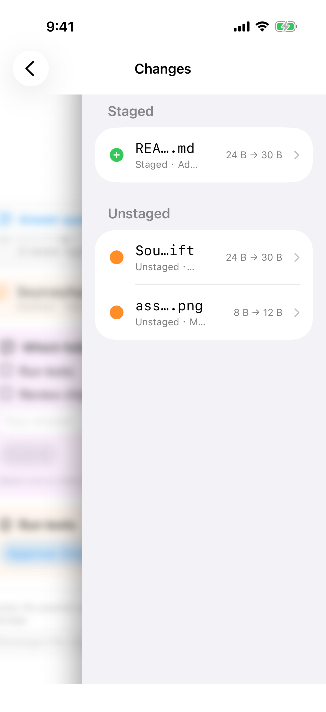
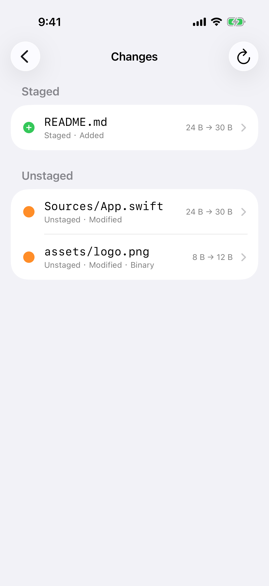
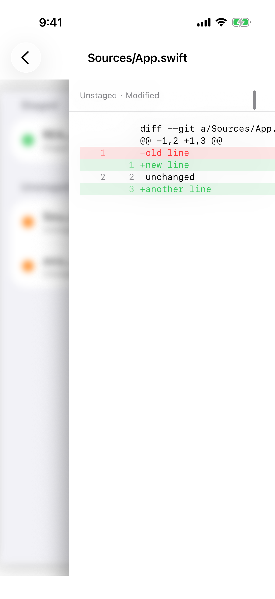

# 空间层变更与差异可读

> 目标: 从会话推进到空间层之后，变更列表和文本 diff 仍能读完文件名、状态和 git 头里的路径。
> 完成判据: `comprehensive` 里从会话进入空间层变更，能读完 `README.md`、`Sources/App.swift`、`assets/logo.png`，以及 `Staged · Added`、`Unstaged · Modified`、`Unstaged · Modified · Binary`。同一文件的文本 diff 不横向滚动就能读完 git 头里的 `Sources/App.swift`，短 diff 仍顶对齐。从会话列表进入的全宽变更列表保持现在这样：路径和状态都是完整的。

## 现象

空间层左侧露出上一层，变更行的剩余宽度再分给体积和箭头。文件名从中间截断，状态也被截断。

同一份变更从会话列表以全宽打开时，三行都能读完，右上角是刷新。

空间层文本 diff 的导航标题 `Sources/App.swift` 和副标题 `Unstaged · Modified` 是完整的。正文里的 `diff --git` 在 `a/Sources/App.` 处被右侧裁掉。短 diff 已经贴在标题下面，着色行在浅色下可读。

## 方案

- [ ] 空间层变更行在当前这台模拟器的竖屏宽度下，完整显示 `README.md`、`Sources/App.swift`、`assets/logo.png`，以及 `Staged · Added`、`Unstaged · Modified`、`Unstaged · Modified · Binary`。体积和箭头可以让位，分组（Staged / Unstaged）可以保留。
- [ ] 全宽变更列表不改布局。刷新仍在这一页。
- [ ] 空间层文本 diff 的 git 头在不横向滚动时能读完 `Sources/App.swift`。正文可以继续横向滚动。短 diff 保持顶对齐，不要在标题和第一行之间留出半屏空白。

## 开发提示

### 可复用能力

- iOS Scenario 运行时里的 `comprehensive`，用它对照空间层和全宽两条入口。
- 现有的变更分组、着色 diff 和顶对齐。这次只解决空间层宽度下读不全，不重做 diff 着色。

### 开发要点

- 界面文案保持英文。
- 空间层返回仍是逐层退回。不要为了腾宽度把返回或拖拽把手拿掉。

### 参考文档

- `docs/product/git-changes.md`「Changes 列表」「Diff Viewer」
- `docs/product/project-files.md`「文件浏览交互」
