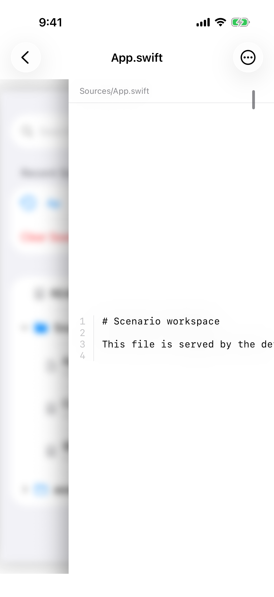
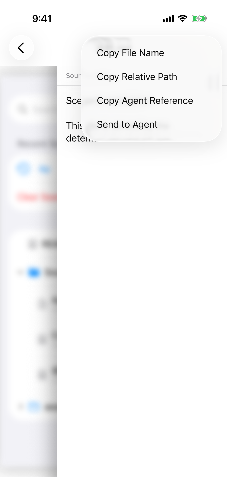

# 源码查看对齐

> 目标: 短源码贴在路径下面，长行要么在这一屏读完，要么能看出可以横向滚动；行号在正文横滑时留在左侧。文件菜单里写入草稿的那一项，文案和「只写入、不发送」一致。
> 完成判据: `comprehensive` 打开 `Sources/App.swift`。正文顶对齐。第二行 `This file is served by the deterministic simulator scenario.` 在这一屏完整可见，或有看得出的横向滚动位置。横向滚动时行号仍在左侧。菜单该项能看出是把引用放进当前会话草稿并返回会话。Markdown 保持现在的顶对齐和段落分隔。

## 现象

`Sources/App.swift` 只有四行。行号和这四行浮在屏幕中部，上面空出一大块。第一行 `# Scenario workspace` 能读完，第二行在 `This file is served by the de` 被裁掉，画面上没有横向滚动的位置。路径 `Sources/App.swift` 因为和标题 `App.swift` 不同而出现在正文上方，这是有用的，保留。

同一文件的菜单有 Copy File Name、Copy Relative Path、Copy Agent Reference、Send to Agent。最后一项实际是把 `@` 加相对路径追加到当前会话草稿并返回，不会发送。

## 方案

- [ ] 短源码顶对齐在路径下面，不再垂直居中。
- [ ] 夹具第二行在 iPhone 17 竖屏上完整可见，或正文有看得出的横向滚动位置。行号不跟正文一起滑走。
- [ ] 从具体会话进入文件时，菜单里写入草稿的那一项让人看出：引用进入当前草稿，然后回到会话，消息不会发出。复制文件名、相对路径和 Agent 引用保持不变。从会话列表直接浏览时仍然只提供复制。
- [ ] 不改 Markdown 的排版。

## 开发提示

### 可复用能力

- 文本 diff 已经把短内容顶对齐，源码查看应对齐到同一阅读起点。
- 现有的复制文件名、复制相对路径、复制 Agent 引用。写入草稿沿用现在的追加行为，只改这项让人读得懂。

### 开发要点

- 界面文案保持英文。不在计划里规定替换后的英文原句，只要完成判据里的含义成立。
- 导航标题继续用文件名。路径只在它比文件名多出位置信息时出现。

### 参考文档

- `docs/product/project-files.md`「文件浏览交互」
- `docs/product/agent-sessions.md`「iPhone 会话与交互界面」
