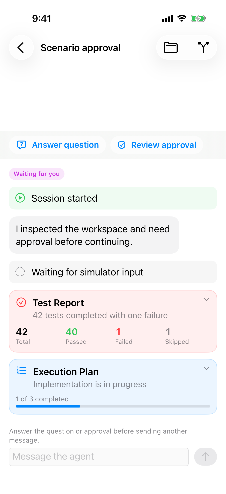
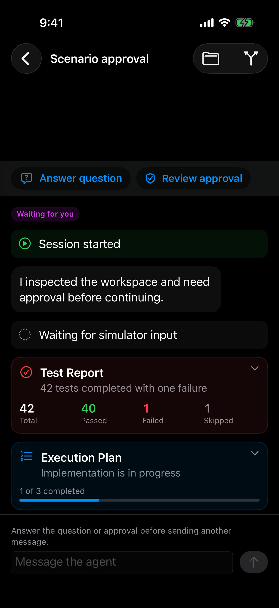

# 会话动态顶部空白

> 目标: 会话动态的第一条内容贴在导航栏下面。有失败的报告不用成功图标。
> 完成判据: `comprehensive` 的浅色和深色会话里，`Answer question` 紧挨导航栏下方，不再有现在这一截空白。失败的 Test Report 不再使用勾。状态徽章 `Waiting for you` 和输入区里「先回答问题或审批」的说明保持不变。

## 现象

导航栏和 `Answer question` / `Review approval` 之间空出大约一条导航栏高的空白。文件页的列表是贴着导航栏的，会话这里多出来的不是安全区。浅色和深色一样。

同一屏上的 Test Report 是红色的，摘要是 `42 tests completed with one failure`，下面还有 `1` 和 `Failed`，图标仍是圆圈里的勾。Execution Plan 的图标和它的完成状态一致，保持。

状态徽章、待处理入口和禁用的输入区是对的：徽章写 `Waiting for you`，输入区说明要先处理问题和审批。

## 方案

- [ ] 浅色和深色下，有待处理事项时，这些入口紧挨导航栏。没有待处理事项时，第一条动态同样紧挨导航栏，不要为了去掉空白把动态钻进导航栏。
- [ ] 含有失败项的报告使用失败语义的图标。全部通过的报告可以继续用勾。

## 开发提示

### 可复用能力

- 文件浏览页已经把列表放在导航栏下方，会话动态的顶部间距向它对齐。
- 现有的状态徽章、待处理入口和「当前不能发送」的说明。这次只收紧空白、改失败图标。

### 开发要点

- 长报告继续在卡片内部滚动，不要把待办再铺回整页动态。
- 深色只要求会话这一页和浅色同一条间距规则。深色变更和深色 diff 不在本里程碑。

### 参考文档

- `docs/product/agent-sessions.md`「iPhone 会话与交互界面」
