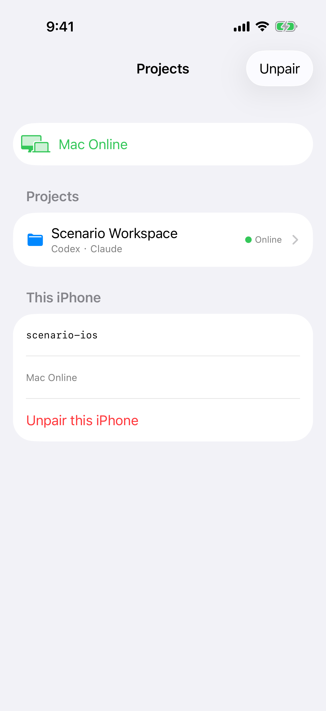
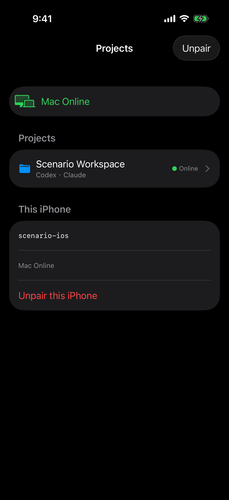
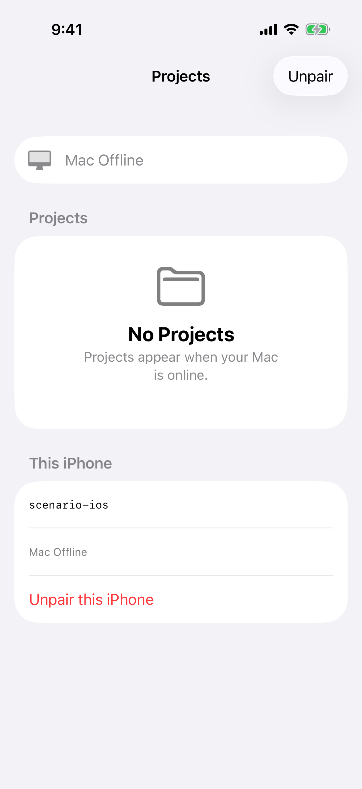
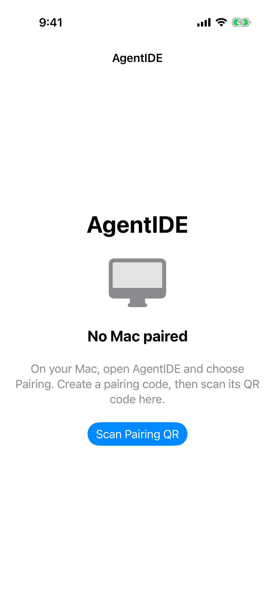

# 项目首页与配对

> 目标: 项目首页把连接状态和解除配对各说一次，设备标识带有说明。配对页的导航标题和大号标题只留一处应用名。相机没有预览时，扫码页说明原因并可以关闭。
> 完成判据: `comprehensive` 与 `offline` 各自只出现一次 `Mac Online` 或 `Mac Offline`，只有一个解除配对入口，设备标识仍在且能看出它标识这台 iPhone。配对页的导航标题和大号标题只留一处应用名；说明句子里的 AgentIDE，以及 `Scan Pairing QR`，还在。模拟器里打开扫码后，页面说明为什么没有画面，并有看得见的关闭。不要求在模拟器里完成一次真实扫码。

## 现象

在线时，导航栏下方有一条绿色 `Mac Online`。`This iPhone` 里又写了一次 `Mac Online`，设备标识 `scenario-ios` 没有任何说明。解除配对出现两次：导航栏的 `Unpair`，以及列表里的 `Unpair this iPhone`。项目行上的 `Online` 说的是这个项目，和 Mac 是否在线不是同一件事，保留。

深色是同一套重复：顶上一条 `Mac Online`，`This iPhone` 里再写一次，解除配对也有两处。

离线时同样是两遍 `Mac Offline`、两个解除入口、没有说明的 `scenario-ios`。空态 `No Projects` 以及「Mac 在线后会出现项目」是对的，保留。

解除之前的确认写明 `Unpair this iPhone?`，并说明只撤销这台手机。这个对话框保持。

尚未配对时，导航标题是 `AgentIDE`，正文里再有一个大号 `AgentIDE`。下面的说明（在 Mac 上打开 AgentIDE、选择 Pairing、创建配对码再扫）和 `Scan Pairing QR` 是需要的，保留。

在这台没有相机画面的模拟器上，扫码页是一张白纸：没有取景、没有原因、没有关闭。这次只能确认「相机没有给出预览」时的样子，不能据此说真机相机正常时也是白纸。

## 方案

- [ ] 在线和离线都只保留一处 `Mac Online` / `Mac Offline`。项目行为空时继续用现在的 `No Projects` 说明。
- [ ] 只保留一个解除配对入口，确认对话框保持现在的文案。解除失败仍是单独提示，不把项目列表换成失败页。
- [ ] 设备标识保留，并有一句说明它标识的是这台 iPhone。
- [ ] 配对页的导航标题和大号标题只留一处应用名。说明句子里的 AgentIDE，以及 `Scan Pairing QR`，保持。
- [ ] 相机没有预览时，扫码页说明原因，并有看得见的关闭。有预览时关闭仍然在。

## 开发提示

### 可复用能力

- 现有的解除配对确认，以及「只撤销这台 iPhone、不撤销 Mac」的结果。
- 现有的在线 / 离线空态和失败页分工：Mac 仍在线但这次列表请求失败时，只显示失败和 Retry，不同时显示 `Mac Online` 或 `No Projects`。本里程碑不改那条规则。

### 开发要点

- 界面文案保持英文。
- 设备标识继续展示，不要为了去掉无说明的一行而把它删掉。
- 扫码验收用模拟器的无预览状态即可，不必接真机相机。

### 参考文档

- `docs/product/device-pairing.md`
- `docs/product/project-files.md`「iPhone 项目列表」
