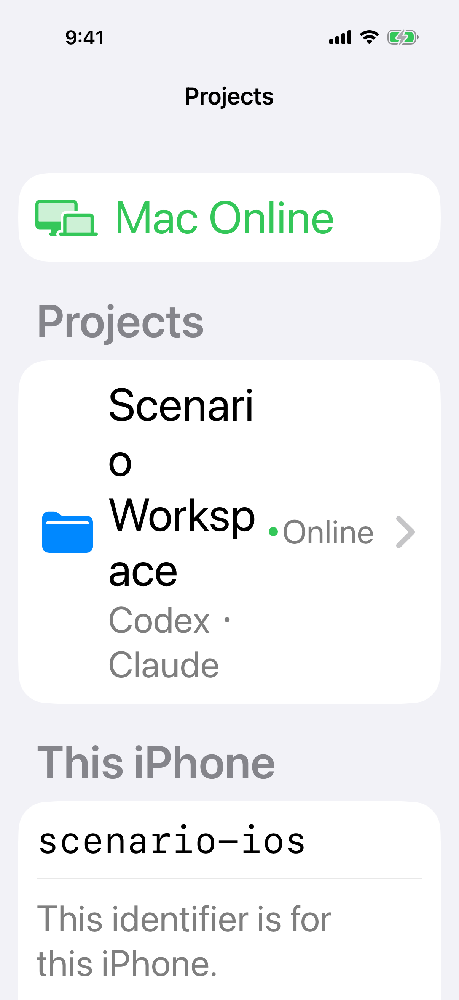
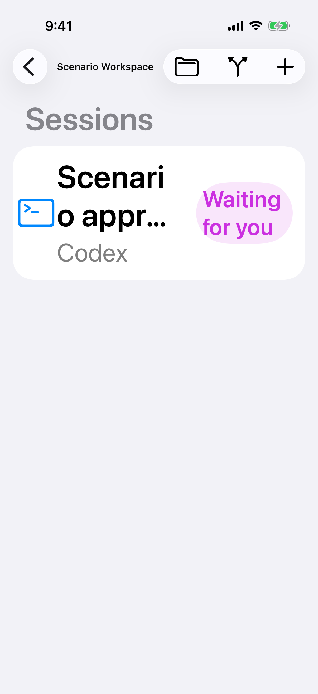
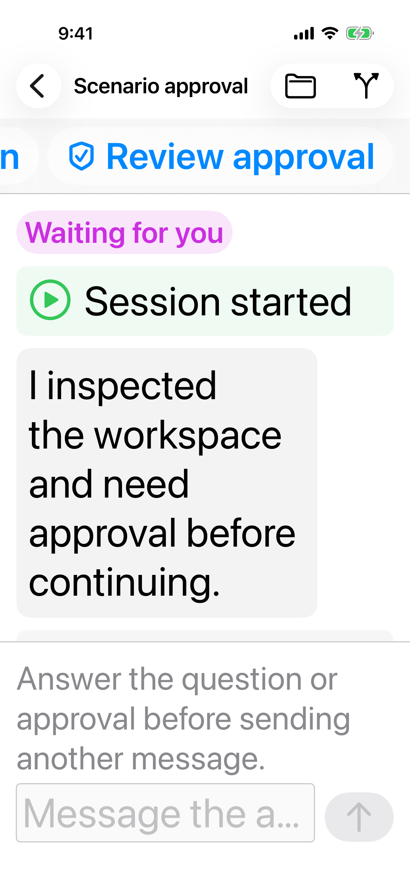
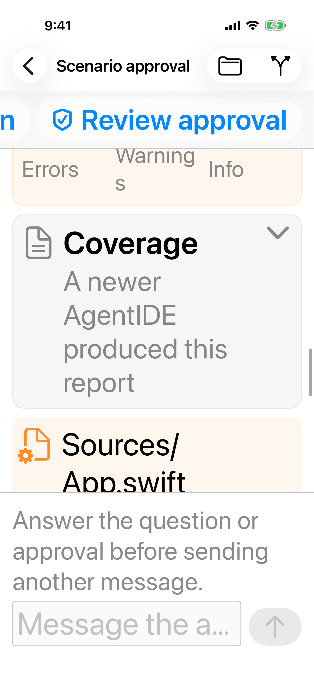

# 动态类型

> 目标：Accessibility XL 下，项目、会话、待回应和报告仍能读完，操作入口完整出现在屏幕内。
>
> 完成判据：iPhone 17 竖屏、Accessibility XL，下面四张截图里的叠字和裁切不再出现；默认字号的现有布局不回退。

默认字号下这些界面是正常的。问题出在文字变大之后，行高、徽章和横向按钮仍按小字号挤在同一行。

## 项目行被拆成单字

项目名、文件夹图标和 `Online` 挤在同一行。`Scenario Workspace` 被拆成 `Scenari` / `o` / `Worksp` / `ace`，图标插在文字中间。

项目行改为纵向排列：名称独占可换行的宽度，Agent 和在线状态放在名称下面。名称按词换行，不按字符硬拆。

## 会话标题和状态徽章重叠

会话标题限制两行后，大字号把 `Scenario approval` 收成 `Scenari` / `o appr...`，右侧徽章盖住标题。

标题使用剩余宽度，徽章换到标题下方，或在标题放不下时单独占一行。截断保留词边界。

## 待处理入口被裁出屏幕

`Answer question` 和 `Review approval` 放在不换行的横条里。字号变大后，第一条只剩一个 `n`，第二条也贴着屏幕边缘。

横条在放不下时改为纵向堆叠，或者保证第一条从内容起点完整可见，后面的可以横向滚动。输入区的说明可以缩短，避免它在大字号下占掉半屏。占位 `Message the agent` 被收成 `Message the a...`，占位改为可换行，或在大字号下隐藏占位、保留辅助功能标签。

## 报告指标和路径被拆开

诊断摘要里的 `Warnings` 断成 `Warning` 和单独一行的 `s`。文件变更路径 `Sources/App.swift` 从斜线中间断开，卡片底部被输入区盖住。

指标在一行放不下时每个指标独占一块，标签不从单词中间断开。路径按路径段换行。卡片底部留出输入区的高度，最后一行不能藏在输入区后面。
