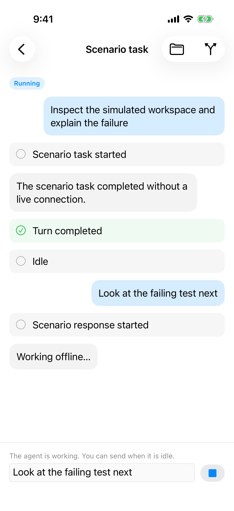
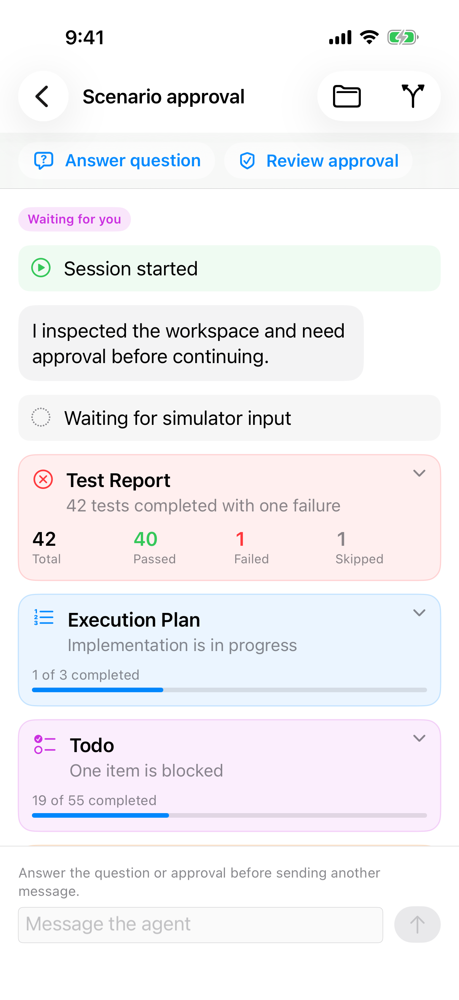
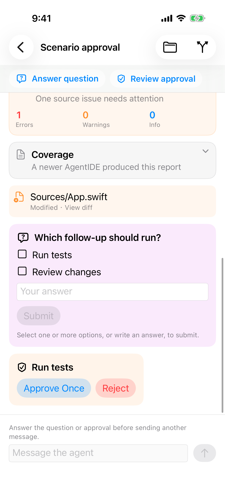

# 会话动态

> 目标：发出去且等待期间没改过的草稿不再留在输入框。有待回应时，打开会话就能到达第一条未回应卡片。
>
> 完成判据：发送成功且等待期间没有改字时输入框为空；失败或确实改过则保留。有未回应的提问或审批时，打开后视口落在第一条未回应卡片，顶部的 `Answer question` / `Review approval` 仍在。

## 发送成功后原文还在输入框

点发送之后，原文已经出现在动态里，状态变成 `Running`，按钮换成停止。输入框里仍是同一句 `Look at the failing test next`，并有 “You can send when it is idle.”

这是场景里看到的结果。代码里 `sendDraft` 记下当时的草稿版本，成功时版本不一致就不清空；`updateDraft` 每次调用都增加版本。现有单测只证明「等待期间又调用了 `updateDraft`」会留下草稿。发送按钮本身只调用 `sendDraft`，没有证实点击发送时输入框又写了一次相同内容。根因实现时再对，不要把「相同文本不要增加版本」预设成改法。

验收只看结果，对应 `docs/product/agent-sessions.md`「iPhone 会话与交互界面」：发送成功且等待期间用户没有改字，输入框清空。发送失败，或等待期间用户确实改了字，保留当前内容。取消轮次之后，已成功发出的那一句也不留在输入框里。

## 打开等待会话时，提问卡片在首屏之外

等待会话的徽章已经是 `Waiting for you`，动态从 `Session started` 和 `Waiting for simulator input` 排起。要回答的问题和审批在报告后面，首屏看不到卡片本身。顶部的 `Answer question` / `Review approval` 仍在，点按会滚到对应卡片，这是现有入口，保留。

`docs/product/agent-sessions.md`「iPhone 会话与交互界面」规定：状态、轮次完成和会话完成各自是活动块。不要改成时间线，也不要拿掉这些卡片。空闲时徽章和 `Idle` 卡片同时出现是这条约定，不是同一件事显示了三遍。

可以改的是打开位置：有未回应的提问或审批时，打开后滚到第一条未回应卡片，而不是停在最早的 `Session started`。

另外，代码在每次 `sequence` 变化时滚到最后一条。上面两张图不能证明用户往上翻之后会被新事件拽回底部。实现时单独确认：用户已经离开底部之后，新事件不把视口拉回去。

## 场景里没有截图、只能从代码确定的呈现

工具块把输入和输出编码成一整段 JSON，用小号等宽字铺开。当前场景没有工具事件。工具先显示名称、状态和一小段摘要，完整 JSON 放进可展开区域。

命令事件没有输出字段，命令块只显示命令和状态，底色是 `Color.black.opacity(0.06)`。深色下几乎看不见是按这个颜色推断的，没有截图。改用系统分组背景，深色和浅色都要能和页面分开。不要写成命令输出已经铺在这块底色上。

会话消息的 Markdown 走 `AttributedString(markdown:)`，没有走文件查看那条会补回标题和段落间隔的路径。多段回复会粘在一起，是对照那条路径做的推断，场景里没有多段会话 Markdown。补一条多段消息后再验收。
