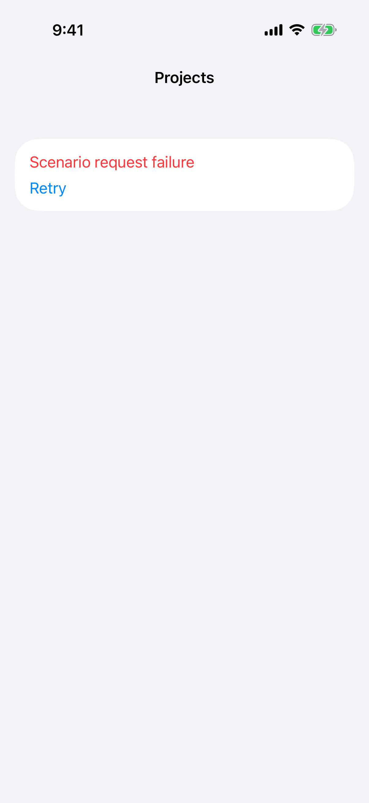
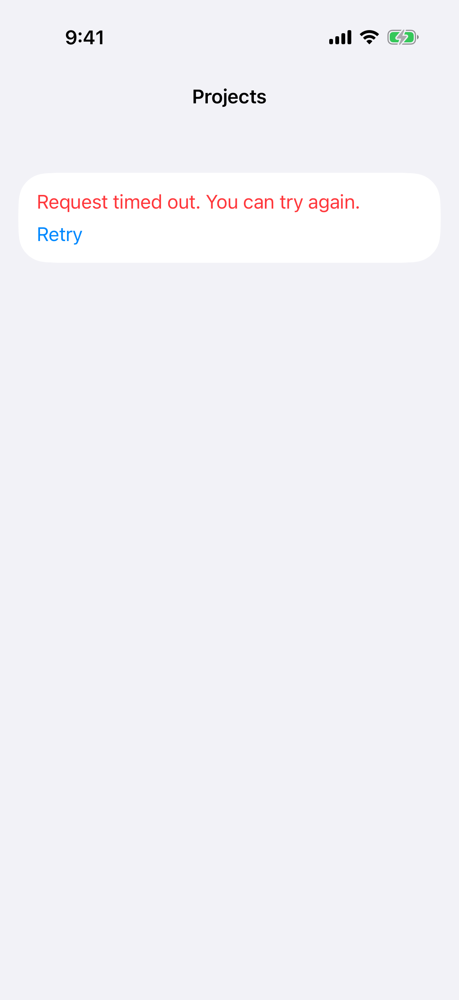
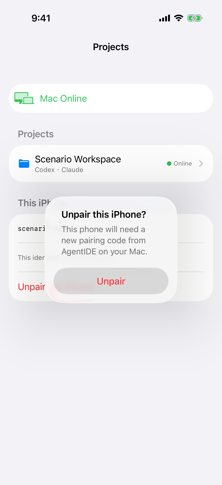
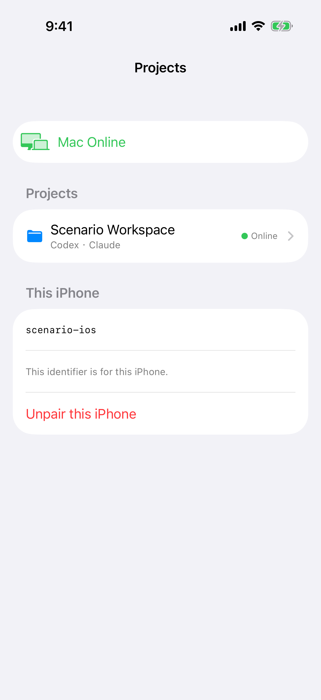

# 项目与连接

> 目标：项目列表失败或超时时，仍能解除这台 iPhone；确认解除时，取消在界面和 VoiceOver 里都能到达。
>
> 完成判据：`request-failure` 和 `timeout` 两个场景里，错误和 Retry 仍在，`Unpair this iPhone` 也在。确认框的界面和辅助功能树里都有取消，点它不解除配对。

## 失败页拿掉了解除配对

Mac 在线但这次项目列表失败时，整页只剩一行红字和 Retry。`This iPhone` 和 `Unpair this iPhone` 都不在。超时是同一种页面。

离线时解除配对还在，在线失败时反而没有。失败区块只替换项目列表，`This iPhone` 保持在页面底部。

## 确认框在界面上看不到取消

确认文案是清楚的。这张截图的对话框里只有红色 `Unpair`。这次辅助功能树里也只找到这一个按钮。点外面也许能关，但没有写出来，VoiceOver 到不了。

代码里的 `confirmationDialog` 已经有 `Button("Cancel", role: .cancel)`，不是漏写按钮。验收是：取消出现在界面和辅助功能树里，并且不解除配对。现有测试只点了 `Unpair`，没有断言取消不存在。

## 设备标识可以缩短展示

已配对首页的下半部分是设备标识和解除配对。`scenario-ios` 和说明、Unpair 在同一张卡片里，和项目行的视觉重量接近。标识本身要留在界面上。

这是呈现提案，不是把标识拿掉。`docs/product/device-pairing.md`「撤销与重新配对」要求 `This iPhone` 展示本机设备标识，说明仍是 `This identifier is for this iPhone.`。默认可以显示缩短的标识；复制，以及需要对完整标识时，仍是完整字符串。解除配对留在这一节的底部。`Mac Online` 与项目自己的 `Online` 都保留：一个是 Mac，一个是这个项目。

## 不能新建时加号没有原因

会话列表右侧是文件夹、分支和加号，辅助功能名已经是 `Browse files`、`Changes`、`Create session`。默认字号和大字号下，导航标题都是完整的项目名。不再加 `Files` / `Changes` / `New`：可见文字会挤占标题，这个取舍已经定过。

加号在 Mac 离线或项目没有启用 Agent 时禁用，列表上没有说明原因。在线且可以新建的会话列表看不出这个状态，这里是读代码。禁用时在列表里写明原因，图标和辅助功能名保持不变。
