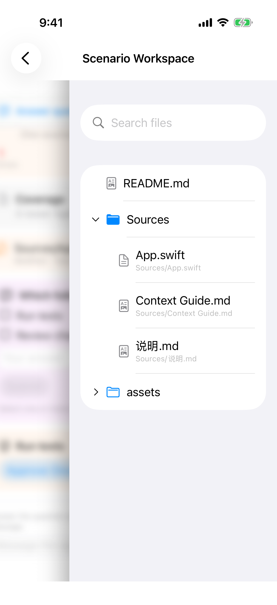
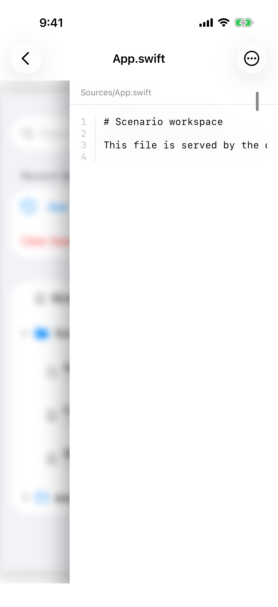
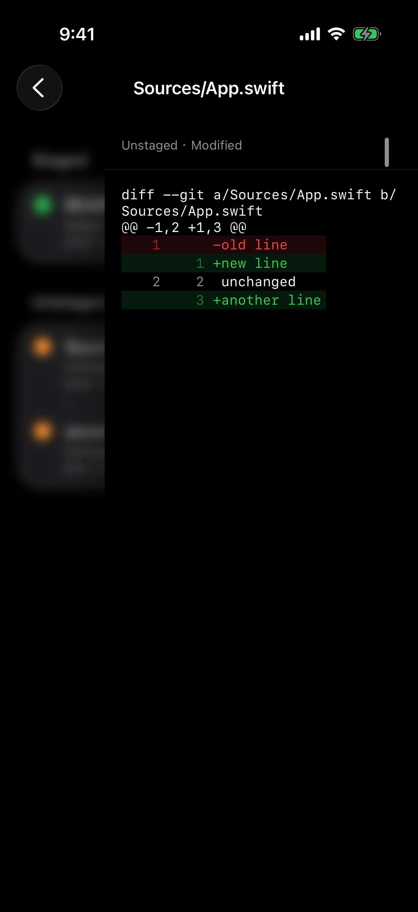
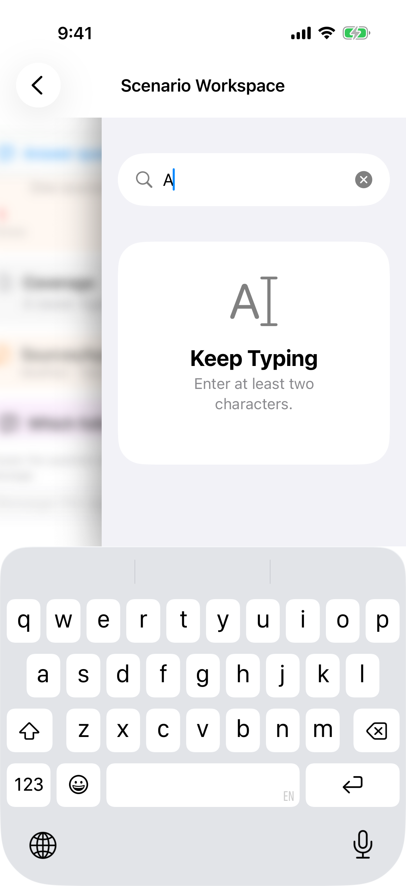

# 文件与差异

> 目标：三处都是呈现提案。文件树用缩进表达位置，空间层里的普通句子能读完，短查询不要把整棵树换成空态。
>
> 完成判据：展开 `Sources` 后，子文件只显示文件名，搜索结果仍显示相对路径。空间层里的 `App.swift` 第二行不用横滑就能读完场景里的那一句，超长行仍可横滑。输入一个字符时，树还在，搜索框附近有一行短提示，请求仍不发出。

这三处都和现有产品文案不同。落地时改 `docs/product/project-files.md` 的对应节，不要当成修缺陷。

## 树里的子项再显示一遍路径

`Sources` 已经展开，下面的 `App.swift` 仍附一行 `Sources/App.swift`。三个子文件都这样。根上的 `README.md` 没有副标题。

`docs/product/project-files.md`「文件浏览交互」规定：相对路径与名称相同时只显示名称；子路径和搜索结果在路径比名称多出位置时仍显示路径。现在的副标题符合这一节。

提案：文件树里只显示名称，位置靠缩进。搜索结果没有树，继续显示相对路径。长按复制相对路径保持不变。

左侧模糊的一层是上一层会话，点它可以退回。这层最宽约 108pt，本身不用改。返回仍以导航栏 Back 为主，不把这一层做成第二套返回按钮。

## 空间层里的普通句子被裁切

文本以等宽字体显示行号。长行横向滚动，行号留在左边。加上左侧让出的一层之后，场景里的第二句 `This file is served by the deterministic simulator scenario.` 在 `the` 后面就被裁掉。这张图只证明裁切，不能证明查看器没有横滑。

`docs/product/project-files.md`「文本与图片查看」规定长行横向滚动。提案只改空间层里的普通句子：按查看区宽度换行，行号仍固定在左侧，当前宽度能读完。超过查看区很多的行继续横滑。Markdown 已经换行，保持现状。

深色模式下的 Diff 能读：增删有底色，文件头在列宽内换行，左侧仍是上一层。Diff 的行着色和超限说明这次不改。

## 一个字符就换成整页空态

搜索框里只有 `A` 时，文件树消失，中间是 `Keep Typing` 和 `Enter at least two characters.`

`docs/product/project-files.md`「项目文件搜索」要求少于 2 个标量时提示继续输入，超过 256 个标量时提示过长且不发送。门槛本身不用改。

提案只改呈现：查询去掉首尾空白后不足两个字符，或超过 256 个字符时，保留文件树和最近搜索，把现有提示放在搜索框下一行，不使用整页空态。空结果和 `More matches exist. Narrow your search.` 保持现在的结果列表。
