# 移动端界面体验改善

## 目标

把 iPhone 客户端已经实现的画面改到能读、能返回、失败时知道下一步。不新增产品能力：不加入源码编辑、Git 写操作、新平台或新协议。

完成判据：下面每一项在对应的 iOS Scenario 里复看时，现象不再出现，空态、失败态和「需要你处理」各自只说一件事。

## 检查方法

2026-09-29，iPhone 17 Pro 模拟器（iOS 26.5），Debug 构建，启动参数 `-mobileScenario`。进程内 Mac 替身，不经 Relay，不持久化身份。状态栏固定为 9:41。截图是模拟器帧，逻辑分辨率 402×874。

走过的场景：`comprehensive`、`interactions`、`reports`、`offline`、`request-failure`、`timeout`、`clean`、`not-git`、`binary`、`too-large`、`search-empty`、`search-limited`、`search-missing-directory`。

深色外观是当时系统默认，没有另发现一套只在深色下出现的问题。浅色、Dynamic Type XXXL、更小机型没有跑。横屏由 XCUITest 旋转后截到的仍是竖屏缓冲，不能当作横屏布局证据，本计划不列横屏缺陷。图片夹具是 1×1 PNG，图片查看器的关闭、标题和路径是齐的，不把空白图片记成缺陷。

`search-limited` 用的查询没有命中，因此没有看到「还有更多结果」的页脚。`search-missing-directory` 的结果行当时点不到「文件已不在」横幅，该横幅未做视觉确认。搜索本身可用：输入 `Ap` 能列出 `App.swift`。

## 问题总览

| 编号 | 严重程度 | 画面 | 现象 |
| --- | --- | --- | --- |
| N1 | 高 | 空间层文本 diff | 只有标题，没有着色 diff 行 |
| N2 | 高 | 系统返回 | 在文件层按导航返回，整段会话被弹出 |
| N3 | 高 | 普通栈文本 diff | 短 diff 浮在中部，首行被裁成 `b/Sour` |
| N4 | 高 | 项目列表失败 | 「Mac Online」和「没有项目」与红色错误同时出现，没有重试 |
| S1 | 中 | 会话 | 提问和审批排在报告下面；标题被状态徽章换掉。待办一展开，它们就被顶出首屏 |
| S2 | 中 | 会话列表 | 项目名被三个图标截成 `Scenario Works...` |
| S3 | 中 | Markdown | 标题和正文粘成 `Scenario workspaceThis file` |
| S4 | 中 | 变更列表 | 文件名掉到斜线下一行，状态说明拆成两行 |
| S5 | 中 | 报告 | 55 条待办展开后占满动态，把提问和审批顶出首屏 |
| S6 | 中 | 文件行 / 搜索 | 根目录名称和路径重复；占位符被截断 |
| P1 | 低 | 配对 | 只有「去扫码」，没有应用名，也没有说明二维码在哪 |
| P2 | 低 | 新建会话 | 任务为空时 Create 不可用，输入框没有提示 |
| P3 | 低 | 各处文案 | 状态大小写不统一；在线只靠颜色点 |
| P4 | 低 | 超限 diff / 非 Git | 重试贴在屏幕底，路径写两遍；非 Git 与干净工作区共用标题「No Changes」 |

## 导航与标题

会话列表、文件层、变更层共用同一组导航按钮。项目名一长，标题先被吃掉。

- [ ] 会话列表的导航标题显示完整项目名。文件夹、变更、新建会话已经有辅助功能名（Browse files、Changes、Create session），保留这些名字，并把可见图标让出标题宽度。iPhone 17 Pro 竖屏上 `Scenario Workspace` 不应变成 `Scenario Works...`。不要为了可发现性再加一排可见文字，那会把标题截得更短。
- [ ] 进入文件或变更之后，不要继续摆「进入文件」「进入变更」这两个按钮。当前空间层里它们仍占着导航栏（见 [文件层](screenshots/05-files-spatial.png)、[变更层](screenshots/08-changes-wrap.png)、[Markdown](screenshots/07-markdown.png)）。从会话列表走系统栈打开的变更页右上角是刷新，两套入口的导航应该各自只留当前页需要的动作。
- [ ] 项目首页有稳定的导航标题（应用名或「Projects」）。现在标题挂在 `NavigationStack` 外面，列表上方只有连接状态卡片，下半屏是空的。

- [ ] 项目行上的 Agent 名称与会话行使用同一套显示名。项目行是 `codex · claude`，会话行是 `Codex`。在线状态除了圆点，还要有文字或辅助功能说明，不能只靠绿色。

## 返回

空间导航是「会话 → 文件 / 变更 → 文件或 diff」逐层退回。系统导航栏的返回是另一套：它弹出整个会话。

在文件层点导航栏返回后，画面落在会话列表，和 [会话列表](screenshots/02-session-list.png) 是同一帧。走查记录的是这个落点；这张图本身看不出「刚刚点过返回」。

文件和 diff 右侧还有一个看起来像返回的箭头。它是拖拽把手，点按没有返回，并且对 VoiceOver 隐藏。真正可点的「回到上一空间层」是一条看不见的左侧条。

- [ ] 人在空间层里时，导航栏返回只退一层：文件或 diff 回到文件 / 变更，文件 / 变更回到会话。退回会话列表只发生在人已经在会话层时。
- [ ] 逐层返回要有一个看得见、点得着、VoiceOver 读得到的控件。拖拽把手如果保留，外观不要做成第二个返回按钮。
- [ ] 左侧退场区域可以继续作为快捷返回，但不能是唯一的返回方式。

## 会话里需要人处理的事

`comprehensive` 会话同时有待办、诊断、未知报告、文件变更、提问和审批。打开后第一眼是被导航栏切掉一截的卡片，会话标题换成了「Waiting User」。提问和审批排在这些报告下面，但这张首屏里已经能看见，底部输入框也占着位置。待办展开之后，它们才被顶出首屏，见下一节。

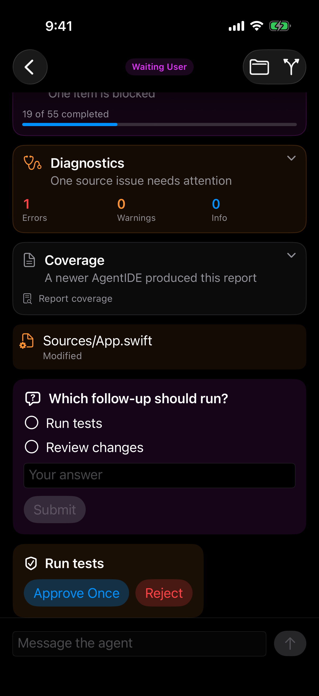

- [ ] 会话导航栏保留会话标题。状态用徽章放在标题旁或动态顶部，文案用完整说法（例如 Waiting for you），不要把枚举名 `Waiting User` 直接当标题。
- [ ] 有未回答的问题或未决审批时，在动态顶部放一条固定入口，点进去就到那张卡片。首屏排在报告后面可以保留；展开长报告时，这条入口仍要留在看得见的地方。
- [ ] 提问在还没选、也没填自由文本时，说明为什么 Submit 不可用。选项可以多选：点一次加入，再点取消，提交的是 `optionIds` 数组。未选中的空心圆看起来像单选，选中后才变成打勾的圆。控件外观要和「可以选多项」一致，不要收成单选。
- [ ] 会话不在可发送状态时，输入区说明原因，或先收起。发送是否可用只看会话是否空闲，界面上看不出来。
- [ ] 文件变更卡片能看出可以打开。现在只有路径和 `Modified`，没有进入 diff 的提示。
- [ ] 动态顶部留出导航栏的遮挡高度。现在只有滚动内容起始处有空隙，往上滑时卡片钻进半透明导航栏。
- [ ] 未知报告种类不要再拼一行和标题重复的 `Report coverage`。卡片已经有标题 Coverage 和摘要。

待办展开后，55 项里的前 50 项直接铺在动态里，提问和审批被顶出首屏。进度「19 of 55 completed」只在摘要里出现一次。截断说明已经有，文案是 `Showing the first 50 of 55 items`，放在展开列表末尾；这张图只拍到 Task 12，所以看不见。

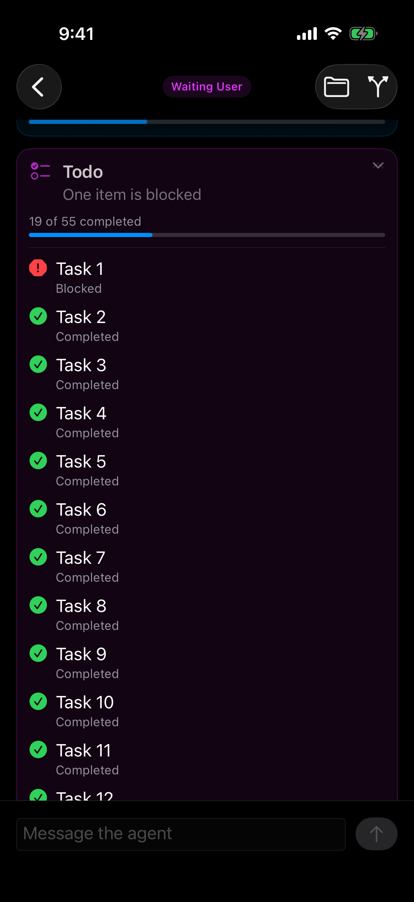

- [ ] 长列表报告默认收成摘要。展开后在卡片内部滚动，或单独打开。现有的截断说明留在卡片里，不必再写一句同样的话。不要用整页动态去承载这 50 项。

## 空间层 diff 与普通栈 diff

同一份 `Sources/App.swift` 文本 diff，两条路径看到的不是同一件事。

空间层只有路径、`Unstaged · Modified`，以及一枚加载指示。着色行没有出现，上一层变更列表从雾化里透出来。

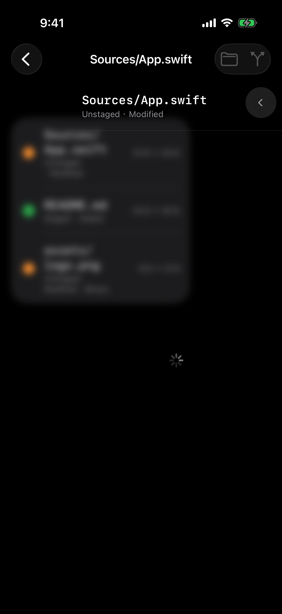

从会话列表进变更、再点同一文件，着色行是有的，但短 diff 浮在屏幕中部，`diff --git` 那一行在 `b/Sour` 被裁掉。超限时说明在中间，「Retry」贴在屏幕最底部，中间一大段空白。

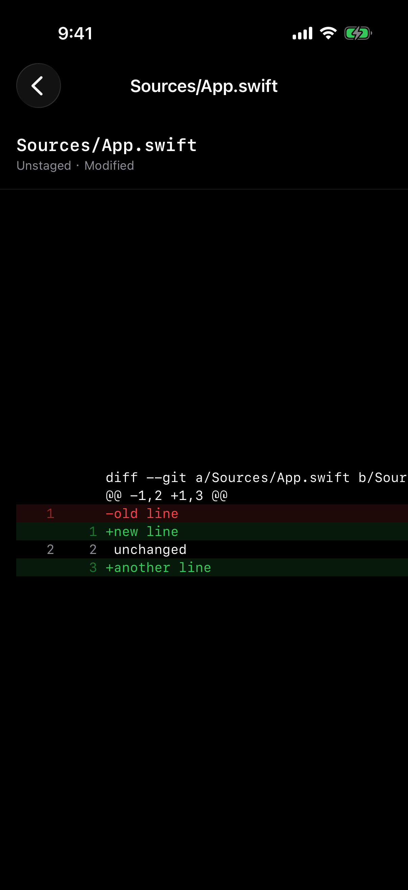

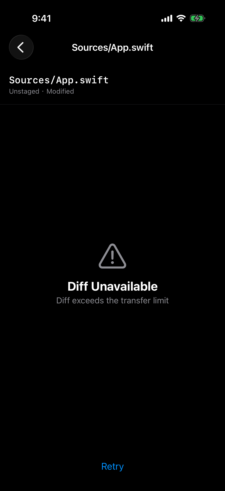

- [ ] 空间层文本 diff 展示与普通栈相同的着色行，并紧挨在标题下面。加载结束前用加载态占住正文区域；加载结束后加载指示消失。打不开时，说明和重试放在一起，不要留下一块能看见下层的空白，也不要照搬现在超限页把 Retry 贴在屏幕底的布局。
- [ ] diff 正文按宽度换行或提供明确的横向滚动，首行路径要能读完。短 diff 顶对齐，不要在标题和第一行之间留出半屏空白。
- [ ] 「Diff Unavailable」和 Retry 放在一起。超限是内容限制，重试不会变小的话，按钮文案要说清楚重试在重做什么。
- [ ] 文本 diff 和超限页的路径不要在导航标题和内容标题里各写一遍 `Sources/App.swift`。二进制 diff 的空态（Binary File）可以保留；这次没有截到二进制页，不把它的路径重复记成已看见的问题。

## 文件与 Markdown

根目录每一行都把名字再写一遍当路径：`README.md` / `README.md`，`Sources` / `Sources`。搜索框占位符被裁成 `Search file names and pa...`。搜索结果已经列出 `App.swift` 之后，卡片下方仍有一枚加载指示；文件层列表出来之后也有同样的指示。

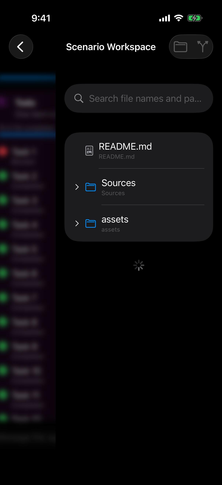

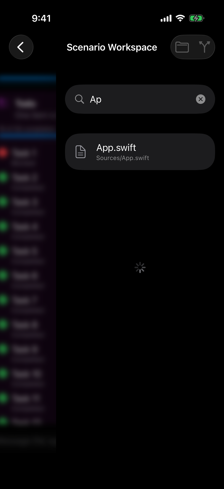

Markdown 由 `AttributedString(markdown:)` 渲染。夹具内容是一级标题加空行加段落，画面上变成一句 `Scenario workspaceThis file is served...`。文件名出现三次：导航标题、内容标题、`Sources/说明.md`。

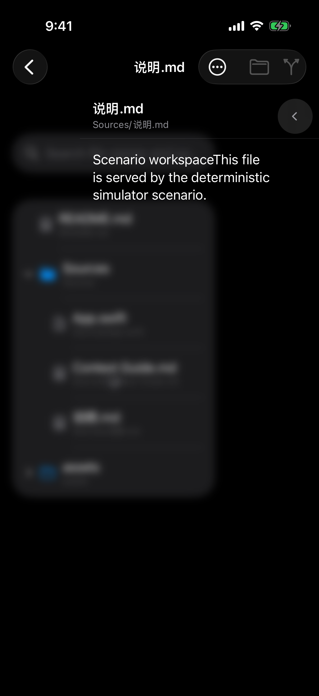

- [ ] 根目录行在名称和相对路径相同时只显示一次。子目录里的文件继续显示能区分位置的路径。搜索结果同样处理。
- [ ] 搜索占位符在文件层宽度下完整可读，或改成更短的说法。搜索进行中才显示加载指示；结果或空态已经稳定后把它拿掉。
- [ ] Markdown 保留标题和段落的分隔。文件名留在导航标题；正文里不再重复同一文件名和同一路径，除非路径比文件名提供了额外位置信息。

## 变更列表

空间层变更把暂存和未暂存放在同一张卡片里。等宽路径在斜线处断开，文件名单独落在下一行（`Sources/` 下一行才是 `App.swift`）。`Unstaged · Modified` 被拆开，`· Modified` 单独一行。`24 B → 30 B` 已经带单位，不作为读数缺陷。行上没有进入 diff 的提示。

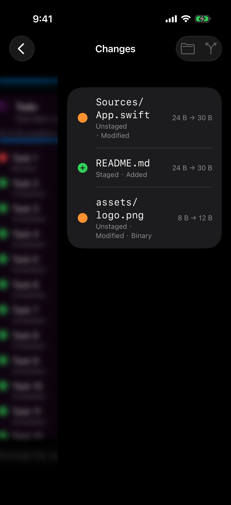

- [ ] 放得下时路径保持一行。放不下时在分隔符前断开，或中间省略，不要让文件名单独掉到下一行，看起来像被截断。状态说明保持在一行：范围、类型、是否二进制。
- [ ] 暂存与未暂存分组，或在每一行用同一套不换行的标记区分。
- [ ] 行上有进入 diff 的提示。小尺寸继续用 `B`。只有将来出现不带单位的一长串字节数时，再改成读得懂的单位。这次的 24 B、8 B 不用改。
- [ ] 不是 Git 仓库时，标题说明「不是 Git 仓库」。干净工作区可以继续用「No Changes」。现在两者标题都是 No Changes，只有副标题和托盘图标不同。

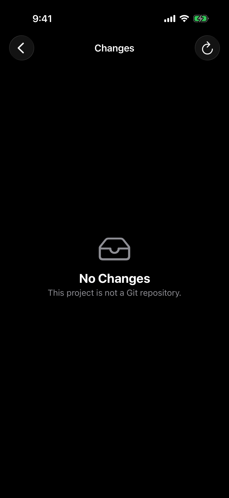

## 失败与空状态

离线是清楚的：`Mac Offline`，空态写「Projects appear when your Mac is online.」没有第二段矛盾文案。

请求失败和超时不是这样。连接条仍是绿色的 `Mac Online`，空态说没有项目、让人去 Mac 上添加，下面再叠一条红色的 `Scenario request failure` 或 `Request timed out`。没有重试。

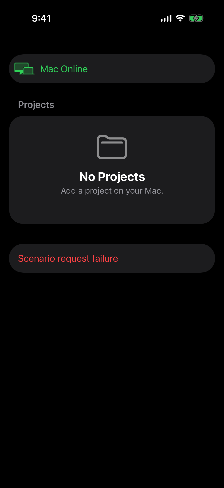

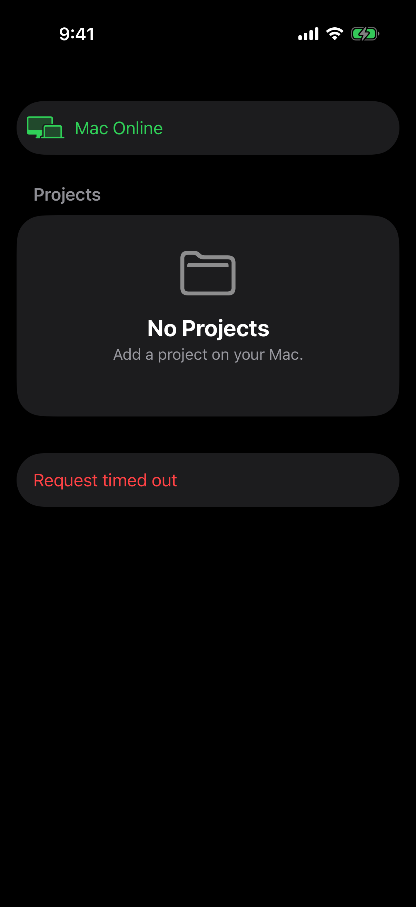

- [ ] 列表请求失败或超时时，只保留失败说明和重试。不要同时显示「没有项目」和「去 Mac 上添加项目」。连接条在这次请求失败时不要继续显示成功的 Mac Online。
- [ ] 超时文案说明可以重试。离线继续用现在这套空态，不和失败态混用。
- [ ] 项目列表以外的失败（文件、搜索、diff）用同一套：发生了什么、能不能重试、重试放在说明旁边。

## 配对与新建会话

未配对时屏幕中间是显示器图标、「No Mac paired」和「Scan Pairing QR」。没有应用名，也没有说明二维码从 Mac 端哪里来。客户端走查里没有解除配对、设置或撤销入口；产品侧可以撤销配对，iOS 上没有对应界面。

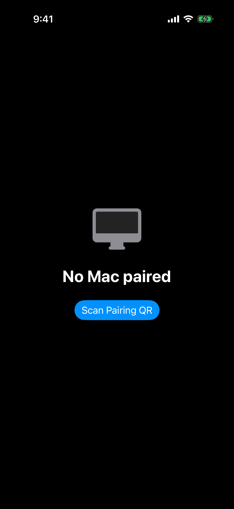

新建会话里，任务为空时 Create 呈不可用，输入框没有占位说明。Agent 选择是清楚的。

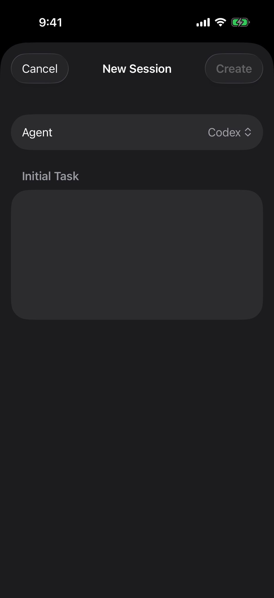

- [ ] 配对页写上应用名，并说明二维码在已安装的 Mac 端哪里打开。按钮保持扫码这一条主动作。
- [ ] 已配对后提供解除配对的入口，并展示手机上已经有的在线状态和设备标识。解除配对沿用现有的撤销自身，不新做配对协议，也不为了显示 Mac 的名字去加新字段。
- [ ] 新建会话的任务框有占位示例。Create 不可用时，能看出是因为任务还是空的。

## 验收

每一项在改完后用原来的 scenario 重走一遍，并对照本目录截图。至少覆盖：

| 场景 | 要看的结果 |
| --- | --- |
| `comprehensive` | 项目首页标题、会话列表标题、会话待回应、文件行（根上名称与路径相同只显示一次）、Markdown、空间层 diff、变更行 |
| 从会话列表进入变更再打开 `Sources/App.swift` | 着色 diff 顶对齐，首行路径完整 |
| `too-large` | 超限说明和重试在一起 |
| `request-failure`、`timeout`、`offline` | 失败、超时、离线三套文案互不覆盖 |
| `not-git`、`clean` | 标题能区分「不是仓库」和「没有改动」 |
| `reports` | 长待办在卡片内滚动或单独打开，提问和审批的顶部入口仍在 |
| 文件层点导航返回 | 回到会话，而不是会话列表。落点看起来会和会话列表相同，要用导航层级确认，不能只比一张静止截图 |
| 未配对启动 | 配对页有应用名，并说明二维码在 Mac 端哪里打开 |
| 会话列表打开新建会话 | 空任务时能看出 Create 为什么不可用 |
| 文件层搜索 `Ap` | 结果列出 `App.swift` 之后，加载指示消失 |

浅色、Dynamic Type、小屏和横屏仍按 [移动端功能扩展](../20260927-移动端功能扩展/README.md)「集中人工验证范围」在版本候选里看，不作为本计划每一项的阻塞条件。本计划里已经在 iPhone 17 Pro 竖屏上复现的截断和换行，不需要等版本候选再改。

## 不在本次范围

- 把 1×1 图片夹具换成可见图片。
- 为搜索「还有更多」或「文件已不在」补视觉结论。这两处这次没有截到。
- 横屏、浅色、Dynamic Type XXXL 的新缺陷。没有证据，不预写改动。
- 源码编辑、Git 暂存 / 提交 / 回滚、推送通知。推送仍由 [05 Push Notification](../20260927-移动端功能扩展/05-PushNotification.md) 负责。
